# Creating Songs
In Codename Engine, there's two ways to add a song to your mod: directly adding the files, and using the editor.

This tutorial will focus on the in-game way of adding songs to your mod.
<h2 id="creating-the-song" sidebar="Creating the song">Creating the song</h2>

When you first open the chart editor on a mod with no songs, you will see this:

	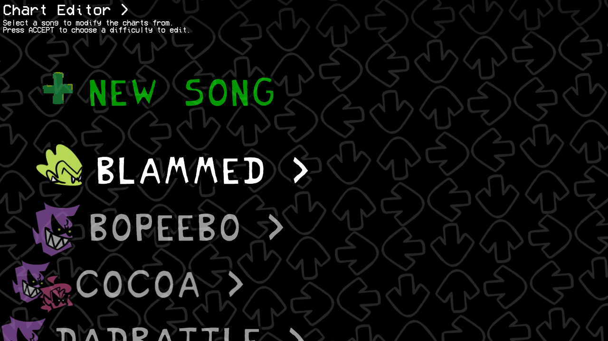

To create your own song, select `New Song` at the top of the list. Doing so will make a popup appear, prompting you to insert some info about your song.

	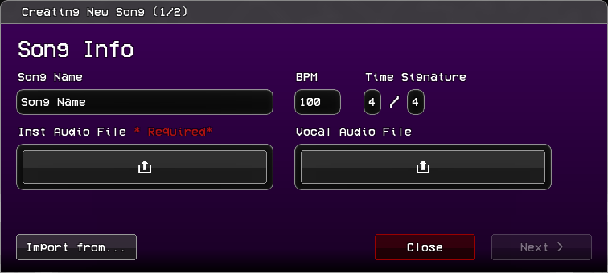

This is the main data of your song:
- `Song Name` is the name of the generated folder, and what the song will be called internally for scripts.
- `BPM` and `Time Signature` are self-explanatory.
- `Inst Audio File` is where you put the Instrumental of your song.
- `Vocal Audio File` is optional, and is where you place the `Voices.ogg` of your song, if you only have one audio file for it. Leave it empty if you're planning on using split vocals.

If you're porting the song from a different engine, you may instead click the `Import from...` button. Otherwise, press `Next >`.

	
📥 Importing from other engines

Codename Engine supports importing charts from other engines, notably:

- `Psych/Legacy FNF` - charts from engines that use the chart format from before the V-Slice update (Week 7 and prior).
- `V-Slice` - JSON charts from the latest version of the base Friday Night Funkin' (Weekend 1 onwards).
- `V-Slice Project (.fnfc)` - V-Slice "Friday Night Funkin'" project files.

	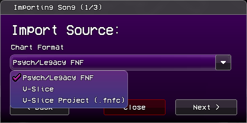

Next, you have to import the audio files. This step can be skipped if you selected `V-Slice Project`.

	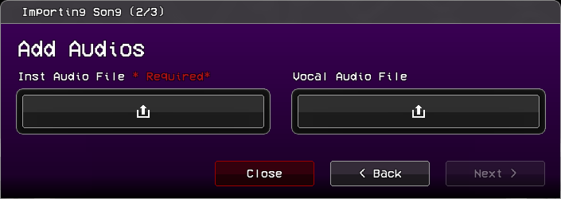

Finally, you need to import the song's data.

	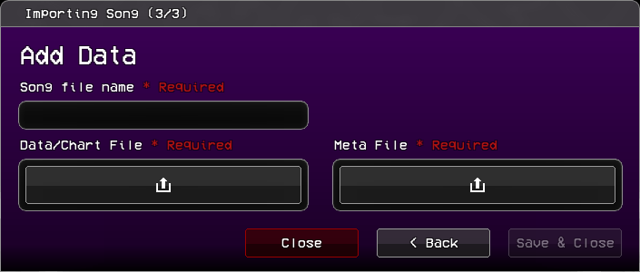

- `Song File Name` - the same as the `Song Name` previously mentioned. Not needed when importing with `V-Slice Project`.
- `Data/Chart File` - The actual chart file. Place the `.fnfc` file if it's a V-Slice Project, otherwise place the `.json`.
- `Meta File` - The metadata of the song. Only needed when importing with `V-Slice`.

After inserting the song info, you move to the Menus Data menu, which is where you insert the song's metadata.

	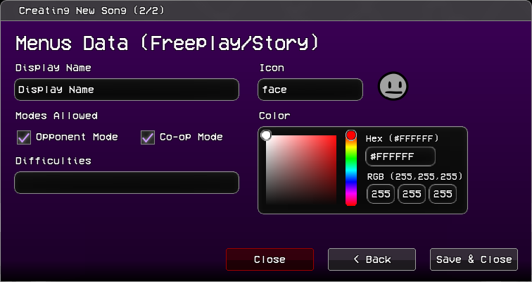

- `Display Name` is what the song will show as in freeplay, story mode, and other menus.
- `Icon` is the associated icon of the song for the chart editor.
- `Modes Allowed` has two options:
  - `Opponent Mode` Swaps computer controlled and player strum lines, making you play as the opponent.
  - `Co-op Mode` Makes opponents be controlled by the secondary controls.
- `Difficulties` is the names of the difficulties the song will have. Each difficulty is separated with commas (ex. `easy,normal,hard`)
- `Color` is the associated color of the song. The freeplay menu will fade to this when this song is selected.

Once you're finished, click "Save & Close" and the song will appear on the song list. Don't worry about getting it right on the first try, you can change all of these later.

	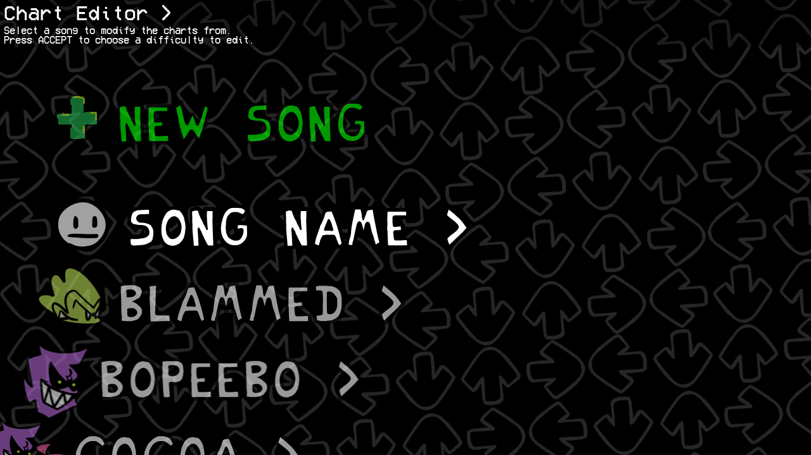

(Disclaimer: once you create a song, all the base game songs will be hidden, both from the chart editor as well as the freeplay menu. You can make them reappear by changing the `SONGS_LIST_MOD_MODE` flag from `override` to `append` or `prepend`.)

<h2 id="adding-diffs-and-variants" sidebar="Adding difficulties and variations">Adding difficulties and variations</h2>

Once you click your song, you'll need to add a difficulty to begin charting. Select the `New Difficulty` option to create a new difficulty. Once you do, this menu will appear:

	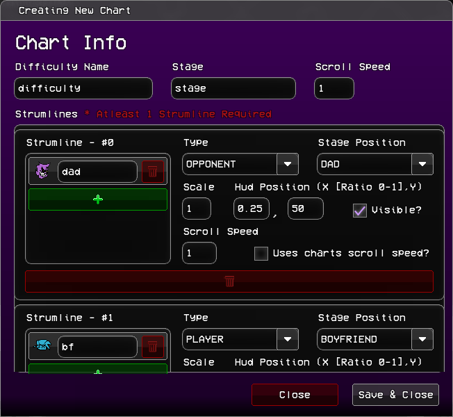

It looks complicated, but for now you only need to worry about the top boxes:
- `Difficulty Name` is what you will call your difficulty. We recommend you keep it all lowercase with no spaces.
- `Stage` is the name of the stage your song will take place in.
- `Scroll Speed` is how fast the notes will move towards their respective strum.

The `Strumlines` can be edited here, but it's easier to do it when already editing the chart. What each of the parameters do will be explained later.

Once done, press `Save & Close`. The game will create your files.

If you want, you may also add variants (ex. pico mixes) to songs. Select the `Add Variation` option:

	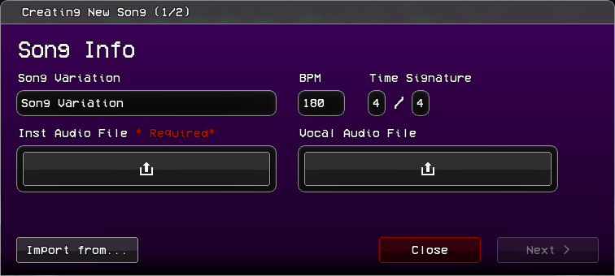

It's the exact same as the song creation process, but instead of `Song Name`, you write the `Song Variation` name.

# The Charter
Once you select a difficulty, you will be sent to the charter.

	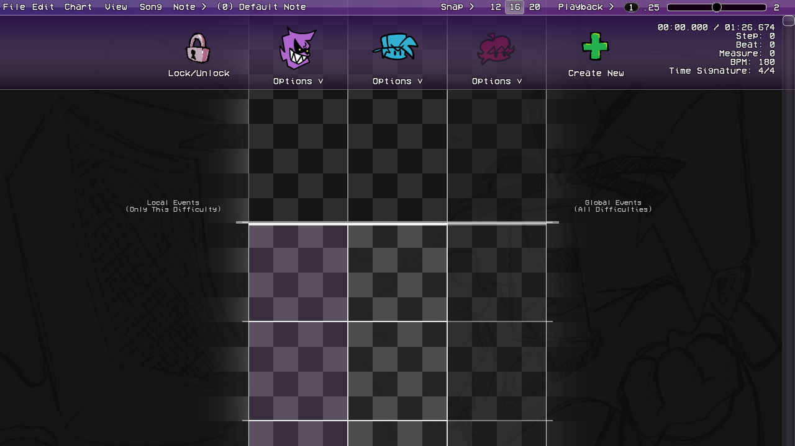

Each character in the song is given a `strumline`. By default, you get one for the opponent (Dad), one for the player (Bf), and one additional strumline (Gf), which is hidden (as seen by the more transparent background). The opponent's strumline will also be highlighted. This indicates that they're currently focused by the camera.

<h1 id="charting" sidebar="Charting the song">Charting the song</h1>

You can now start charting. The most important controls are:
- `Space` plays/pauses your song.
- `Left Click` on any empty spot to place a note.
- `Right Click` to delete any note.
- `Q` and `E` decrease and increase the sustain length of the last selected note by one grid's length.
  - You can also directly drag the sustain tail up and down, which allows you to move it by the grid snap's length.
- `Z`and `X` decrease and increase the grid's snap, respectively. You can see and change the current snap on the top bar.
  - You can also disable snapping altogether with `Shift`.
- You can select multiple notes by `Clicking and Dragging` like you would do files on your desktop. this allows you to **copy**, **cut**, and **move** multiple notes around.
  - You can also copy notes by holding `Alt` and dragging your selection.

Other controls can be found on the top bar's menus.

<h2 id="events" sidebar="Adding Events">Adding Events</h2>

You may have noticed the two `Local Events (Only this Difficulty)` and `Global Events (All Difficulties)` texts to the left and right of the charter. This is because in Codename Engine you can have two types of events: `Local` and `Global` Events. Like it says in the two texts, the difference is that local events are saved with the chart and only run for the current difficulty, while global events are saved separately in `events.json` and show up for all difficulties of the current variation.

To add an event, hover your mouse over whichever type's side you want your event to be.

	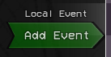

Once `Add Event` shows up, click it to add an event marker at its position.

Initially, this event marker will have no events.

	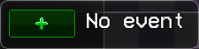

To add an event, click the `+`.

Once you do, this menu will show up:

	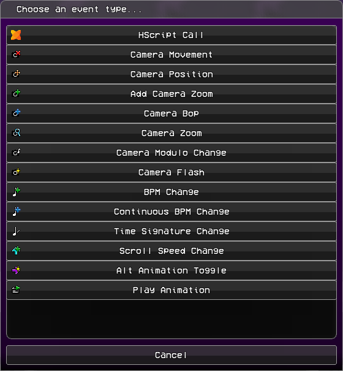

These are all the default events of the engine. If you previously added any custom events (in `data/events/`), they will show up below these.

If you're confused as to how to use any of these, they're all explained this section. You may skip this otherwise.

	
📸 Default Codename Engine Events

| Icon | Name | Function | Parameters
| - | - | - | -
|  | Hscript Call | Calls a function from loaded scripts. | `Function Name`: The name of the function.  `Function Parameters (String split with commas)`: The parameters of the called function.
| 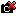 | Camera Movement | Moves the camera to a specified character. | `Camera Target`: Which character the camera should move to `Tween Movement?`: If unchecked, movement will be instant. `Tween Time (Steps, IF NOT CLASSIC)`: How long the movement should last. `Tween Ease (ex: circ, quad, cube)`: The movement's ease. If set to `CLASSIC`, the camera will instead "lerp" to the character (like most other engines), ignoring the time and tween type. `Tween Type (excluded if CLASSIC or linear, ex. InOut)`: The type of the selected ease. In speeds up at the start, Out slows down at the end, and InOut does both.
| 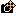 | Camera Position | Moves the camera to a specified position. | `X`: The X position on the stage. `Y`: The Y position on the stage. `Tween Movement?`: If unchecked, movement will be instant. `Tween Time (Steps, IF NOT CLASSIC)`: How long the movement should last. `Tween Ease (ex: circ, quad, cube)`: The movement's ease. If set to `CLASSIC`, the camera will instead "lerp" to the position, ignoring the time and tween type. `Tween Type (excluded if CLASSIC or linear, ex. InOut)`: The type of the selected ease. In speeds up at the start, Out slows down at the end, and InOut does both. `Is Offset?`: If checked, the `X` and `Y` parameters will instead be relative to the current position of the camera.
| 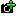  | Add Camera Zoom | Adds a set amount of "zoom" to a camera, but does not set the camera's zoom. | `Amount`: How much zoom is added.  `Camera`: Which camera is affected.
|  | Camera Bop | causes a camera bop. | `Amount`: How much the camera bops by.
|  | Camera Zoom | Zooms the camera. | `Tween Zoom?`: If unchecked, the zoom will be instant. `New Zoom`: The desired zoom.  `Camera`: Which camera gets zoomed. `Tween Time (Steps)`: How long the zoom should last. `Tween Ease (ex: circ, quad, cube)`: The zoom's ease. `Tween Type (excluded if linear, ex. InOut)`: The type of the selected ease. In speeds up at the start, Out slows down at the end, and InOut does both. `Mode`: `direct` uses a base zoom of 1 as the reference point. `stage` uses the stage's default zoom as the reference point instead. `Multiplicative?`: If checked, the new zoom is multiplied on top of the camera's current zoom rather than replacing it.
| 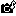 | Camera Modulo Change | Changes the interval and strength of the camera bops. | `Modulo Interval`: How frequently the camera will bop. Counts depending on `Every beat type`. For example, `2` with `BEAT` type will make it bop every 2 beats. `Bump Strength`: How strong these bops are. `Every Beat Type`: Defines what the interval will count between bops. `Beat Offset`: The offset at which these bops happen.
|  | Camera Flash | Flashes a camera. | `Reversed?`: If checked, the flash will fade in instead of out `Color`: The flash's color. `Time (Steps)`: How long the flash lasts. `Camera`: Which camera the flash happens on.
| 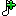 | BPM Change | Changes the Beats Per Second of the song. | `Target BPM`: The desired BPM.
|  | Continuous BPM Change | Same as `BPM Change`, but over a set time. |`Target BPM`: The desired BPM. `Time (steps)`: How long the BPM change will last.
|  | Time Signature Change | Changes the time signature of the song. | `Target Numerator`: How many beats are in a measure. `Target Denominator`: What note value (quarter note, eighth note, etc.) defines a "beat". `Denominator is Steps Per Beat`: If checked, the denominator is instead how many steps are in a beat.
| 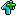 | Scroll Speed Change | Changes the scroll speed of the song. | `Tween Speed?`: If unchecked, the change will be instant. `New Speed`: The desired scroll speed. `Tween Time (Steps)`: How long the change should last. `Tween Ease (ex: circ, quad, cube)`: The change's ease. `Tween Type (excluded if linear, ex. InOut)`: The type of the selected ease. In speeds up at the start, Out slows down at the end, and InOut does both. `Multiplicative?`: If checked, the new speed is multiplied on top of the current scroll speed rather than replacing it.
|  | Alt Animation Toggle | Changes the suffix of every character in a strumline's animations to `-alt`. | `Enable On Sing Poses`: Adds the suffix to the characters' sing poses. `Enable On Idle`: Adds the suffix to the characters' Idle. `Strumline`: The target strumline.
|  | Play Animation | Plays a character's animation. | `Character`: The target strumline. The animation will play for every character in the selected strumline. `Animation`: The animation you want the character(s) to play. `Is forced?` If unchecked, the animation will not play if the character is already playing it. `Animation Context`: Changes how the animation interacts with the character's idle. `NONE` will disable the idle until the animation is over, `SING` and `MISS` will disable it for as long as the character's sing animation length, `DANCE` won't disable it, and `LOCK` will disable it until another animation that allows idling is played.

Once you've picked an event, it will show up where you placed it.

For example: this is what the `Camera Movement` event will look like.

	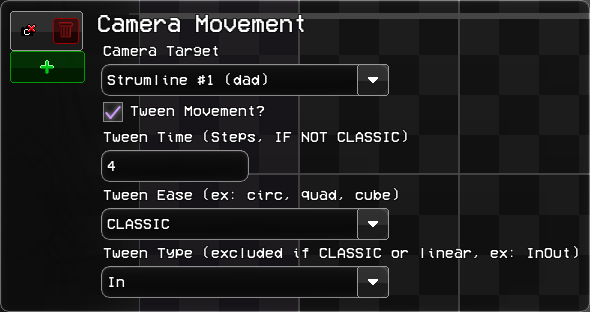

Change the properties to your liking, and click off the event to save those changes.

In the case of some events, they will visually change to reflect what they will do once activated. These changes are explained in the `Default Codename Engine Events` section.

You can also add multiple events in one marker. Simply press the `+` again and add another event. Note that events in the same marker run bottom to top, so if you encounter any issues, try to reorder the events by dragging them around.

<h2 id="top-bar" sidebar="Top Bar - All Menus">Top Bar - All Menus</h2>

At the top of the screen, there is a bar:

	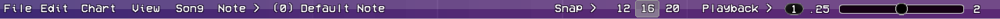

Directly on it, there are multiple menus, which will be explained in their own sections. They are:

- `File` - Saving and exporting.
- `Edit` - Direct chart manipulation.
- `Chart` - Playtesting and data editing.
- `View` - Visual settings, like zooming and separators.
- `Song`- Volume controls and other miscellaneous options.
- `Note` - Note options.
- The Currently selected note type, and its associated keybind.

On the right, it also has:
- `Snap` - Lets you change the grid snap of notes, events, and dragged sustain tails.
- The current grid snap, and the two closest snap sizes.
- `Playback` - Song speed and Metronome. Also lets you move in steps and measures.
- The current playback speed.
- Playback speed slider. Goes from 0.25x speed to 2x speed.

For any of the options, you can also use them by hitting the keybinds written on the right in gray. If using a Mac, replace `Ctrl` with `Command`.

<h3>File</h3>

	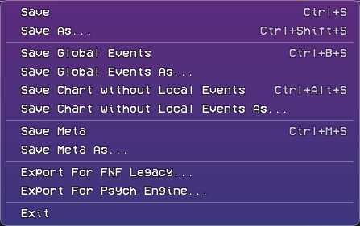

(any `As...` option does the same as its normal counterpart, only letting you choose where it gets saved to)

- `Save` - Save the current `[difficulty].json` file. If any global events are present, those will be saved separately in `events.json`. Also saves `meta.json`.
- `Save Global Events` - Save ONLY the `events.json` file.
- `Save Chart without Local Events` - save the difficulty file without any of the left side events.
- `Save Meta` - Save only the `meta.json` file.
- `Exit` - Closes the charter and sends you back to the previous menu. Gives a warning if the chart wasn't saved.

You can also export for the `FNF Legacy` and `Psych Engine` formats, to then import to those engines (Legacy/V-slice and Psych Engine, respectively).

<h3>Edit</h3>

	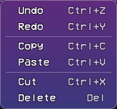

Most options here are self-explanatory, as they work the exact same as they do on most software.

However, `Delete Stacked Notes` is special: it checks the current selection (or chart, if nothing is selected) and removes any notes that overlap another (ex. two left notes placed at the same step).

<h3>Chart</h3>

	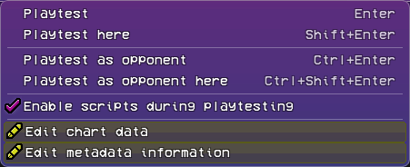

- `Playtest` plays the song from the start.
- `Playtest here` plays the song from the current song position.
- `Playtest as opponent` and `Playtest as opponent here` do the same, but in Opponent Mode.
- `Enable scripts during playtesting` is self-explanatory. When unchecked, any scripts that would normally run during the song are disabled. Use this in case there are any problems when using `Playtest here`.
- `Edit chart data` Lets you change the **stage** and **scroll speed** of the song.
- `Edit metadata information` Lets you change the metadata of the song. Explained previously during the song creation process.

<h3>View</h3>

	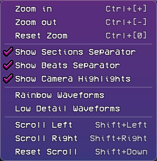

- `Zoom in`, `Zoom out` and `Reset zoom` are self explanatory. You can also zoom in and out by holding ctrl/command and using the scroll wheel. The `[+]`, `[-]` and `[0]` are the **Numpad** versions of those keys.
- `Show Sections Separator` toggles the thicker lines that appear between measures.
- `Show Beats Separator` toggles the thinner lines that appear between beats.
- `Show Camera Highlights` toggles the icon-colored background that appears for the character that is currently being focused by the camera. This highlight changes for every `Camera Movement` event.
- `Rainbow Waveforms` makes the waveforms of the strumlines rainbow for .
- `Low Detail Waveforms` makes the waveforms less detailed to increase performance.
- `Scroll Left` and `Scroll Right` move the strumlines one grid to the left and right. `Reset Scroll` recenters them.
  - You can also hold shift and move the scroll wheel up and down to move left and right, respectively.

<h3>Song</h3>

	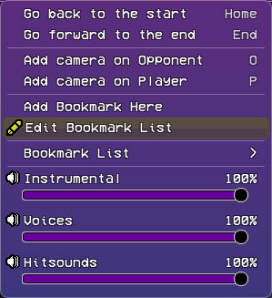

- `Go back to the start` and `Go forward to the end` will move the song position to the beginning and end of the song, respectively.
- `Add camera on Opponent` and `Add camera on Player` will add a global `Camera Movement` event to the chart at the current time.
  - While not written, you can hold `Alt` to make the event local, and `Shift` to disable the snapping like you can do with notes.
- `Add Bookmark Here` Lets you add a bookmark (a sort of "shortcut" to different parts of the song). You can set the name and color of them.
- `Edit Bookmark List` allows you to change the name of each bookmark, and their order in the Bookmark List.
- `Bookmark List` only appears once you have at least one bookmark in your song. There, you can select your bookmarks to go to them.
- `Instrumental`, `Voices` and `Hitsounds` let you control the volume of those sounds. You can either change them by dragging the bar, or mute/unmute them by clicking the  speaker icon.

<h3>Note</h3>

	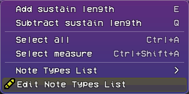

- `Add sustain length` and `Subtract sustain length` add and remove sustain length from the currently selected notes.
- `Select all` and `Select measure` are self-explanatory.
- `Note Types List` shows the note types that are part of the current difficulty. By default it only has the `Default Note`, which you can hotkey to with `0`.

Finally, `Edit Note Types List` is where you add your custom note types. If your song doesn't need custom notes, you can skip the next section.

<h2 id="notetypes" sidebar="Custom Note Types">Custom Note Types</h2>

(If you don't have a note type already in your mod's files, either get one from the Codename Engine Server's Scripts channel, or learn how to make one in the [Custom Notetypes page](../scripting/events.html).)

	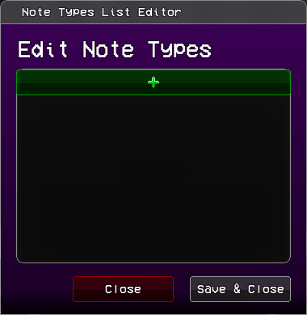

Once you have your custom note type in `data/notes`, to use it in your song, add an index by pressing the `+` on the note types list. Once you do, a new note type with the name `Note Type X` will be created (`X` will be a different number depending on how many note types already exist in your song).

To make it your note type, rename it to **exactly** your note type's name. **This is almost always case-sensitive (`hurt note` is NOT the same as `Hurt Note` when scripting)**.

if your note has a custom note skin with that exact name (inside `images/game/notes`), it will show that skin here.

You can delete change the order of the notes, but know that **the charter will not automatically change every note to be the correct index**. If you swap two notes in the list, those two notes will be swapped throughout the entire chart, so make sure you have the order you like before adding note types.

The base engine already comes with two common note types.

	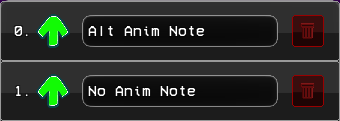

- `Alt Anim Note` will play the characters sing animations with the suffix `-alt`, if they have any.
- `No Anim Note` will not play the sing animation when pressed.

<h2 id="edit-strumline" sidebar="Adding/Editing Strumlines">Adding/Editing Strumlines</h2>

You can unlock the strumlines' positions by pressing the `Lock/Unlock` icon next to them.

	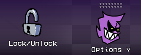

You can then drag them to change their order.

You can also add new strumlines by pressing the `Create New` button.

	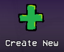

What each parameter does is explained later.

To edit a strumline, open the `Options` menu.

	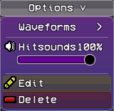

- `Waveforms` lets you add a waveform to a strumline for easier charting (this includes the instrumental)
- Hitsounds is the individual hitsound volume of this strumline. works like the volume bars in the `Song` menu of the top bar.
- `Edit` opens the strumline editing menu.
- `Delete` removes the strumline completely.

Once you click `Create New` or `Edit`, a menu like this will appear:

	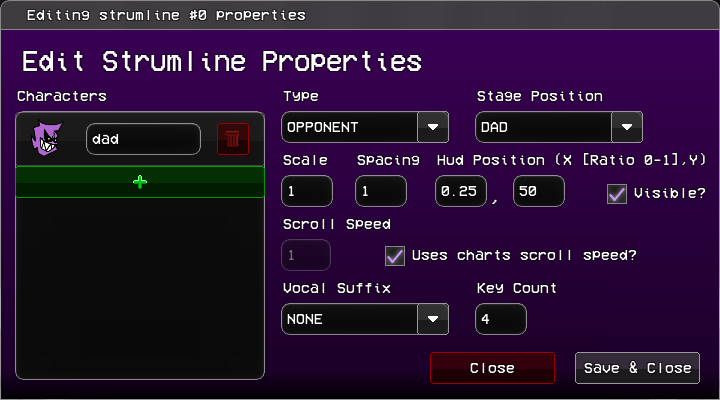

(It'll say "Create New Strumline" if you're making a new strumline, otherwise it's the same)

On the left side is where each of the characters associated with this strumline are shown. You can delete, add, and change which characters make up a strumline.

On the right side are the properties of the strumline, which are all previewable:
- `Type` defines what the strumline will do.
  - `OPPONENT` is a computer-controlled strumline which turns playable in opponent mode.
  - `PLAYER` is a player-controlled strumline that becomes computer-controlled in opponent mode.
  - `ADDITIONAL` is **always** computer-controlled.
- `Stage Position` defines where the strumline's characters are placed. Can be `DAD`'s, `BOYFRIEND`'s or `GIRLFRIEND`'s positions.
- `Scale` changes the size of the strums.
- `Spacing` changes the space between each strum of the strumline.
- `Hud Position` changes where the center of the strumline is placed.
  - `X` is a percent. `0` is on the left of the screen and `1` on the right.
  - `Y` is the pixel position of the strumline.
- `Visible` defines whether the strumline shows on screen.
- `Scroll Speed` is the strumline's individual scroll speed. It can only be changed if `Uses charts scroll speed?` is unchecked, otherwise the strumline will use the global scroll speed.
- `Vocal Suffix` sets the vocal track assigned to the strumline. any song track that starts with `Voices-` will appear here.
- `Key Count` defines how many strums make up the strumline.