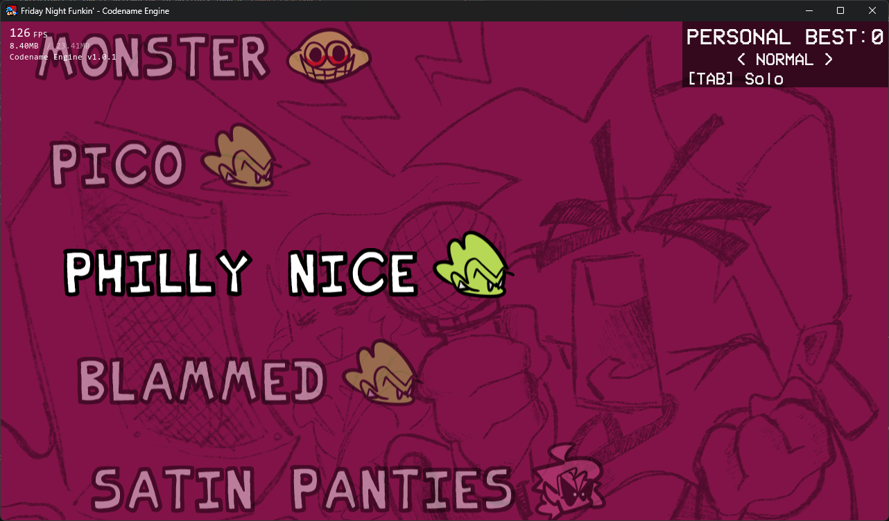
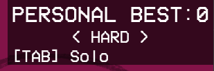
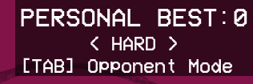
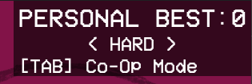
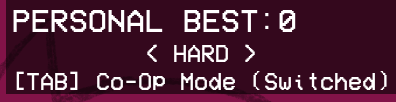

<h1 id="do-i-compile" sidebar="Compiling??">Do I need to compile the engine?</h1>
No! It is reccomended to use the engine as is, as the engine comes with modding tools out of the box.

### The only reason you should think about compiling the engine is to make Feature Requests, fix bugs, and / or add features for your mod that Modding Tools can't provide (So you can add them yourself).
Otherwise you can just use the `./mods/` folder to make your mod!

<h1 id="navigate" sidebar="How to navigate the engine">How to navigate the engine</h1>

The engine is basically similar to what you'd expect, but here are the immediate differences you will see.

<h2 id="options-menu" sidebar="Options Menu">Options Menu</h2>

    
    

Here you can see what the default menu looks like, and is formatted like a Tree Menu with branching options in categories, and sub-states for more customizability.

### Controls Menu

#### TODO: Put a link here to learn more about how your mod can make custom Options with the XML, same for custom Controls.

### Developer Options

To start using Modding Tools, and shortcuts (seen in the Keybind Menu) you need to enable the `Developer Mode` option in the Miscellaneous Tab. This will allow you to use keybinds to Refresh the current state, open up some Debug Menus, and reload your Global Script(s).

<h2 id="mod-select-menu" sidebar="Mod Select Menu">Mod Select Menu</h2>

This menu is accessed by pressing `TAB` (by default) in the `MainMenuState`. Selecting `"Disable Mods"` will use just load the default [`AssetLibrary`](./modding/libraries.md)'s (i.e the `./assets/` folder).

If you want a mod to Automatically load when launching the game, you can place a `autoload.txt` in your `./mods/` folder and inside it, just put the folder name of the mod you want to load (no file extensions if you're attempting to possibly load a `Compressed Mod`)
#### As of right now, `Compressed Mods` hasn't been properly implemented, there is a PR that implements it and is planned on being merged in the near future.

<h2 id="fps-debugger" sidebar="FPS Counter">FPS Counter</h2>

You can toggle the FPS Counter into 3 different states by pressing `F3`. (Currently you cannot change the keybind for this)

These are all the states you can cycle through:
1. Disabled
2. FPS, RAM Usage / Allocated RAM, Build Version
3. Advanced Details

You can see A lot of useful information about what state the game is in, what is currently happening, and all your loaded [`AssetLibrary`](./modding/libraries.md)'s.

<h2 id="freeplay-state" sidebar="Freeplay State">Freeplay State</h2>

The `FreeplayState` is hasn't changed much, besides the Gamemode Types you can cycle and add onto yourself.
#### TODO: Add a link to explain How to add custom Gamemode Types.
## Gamemode Types
1. Solo
2. Opponent Mode
3. Co-Op Mode
4. Co-Op Mode (Switched)

  
  
  
  

Co-Op Mode will use your Player 1 Keys for Dad, and Player 2 Keys for Boyfriend. The Switched Variant swaps them.

## That's all the changes you really need to know / worry about for Codename Engine.