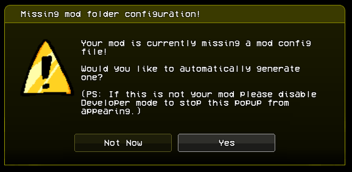

# Modpack Configuration
When you first load up your Modpack for the fist time, you will see this warning message:
<div style="display: flex; justify-content: center;">
    
</div>

Clicking yes will autogenerate a `modpack.ini` file for you, and opening it from `./data/config/modpack.ini` should look something similar to this:
```ini
[Common] # This section applies the 'MOD_' prefix to the flags so you don't have to.
NAME="YOUR MOD NAME HERE"
DESCRIPTION="YOUR MOD DESCRIPTION HERE"
AUTHOR="YOU/YOUR TEAM HERE"
VERSION="YOUR MOD'S VERSION HERE"

# DO NOT EDIT!! this is used to check for version compatibility!
API_VERSION=1

DOWNLOAD_LINK="YOUR MOD PAGE LINK HERE"

# Not supported yet
;MOD_ICON64="path/to/icon64"
;MOD_ICON32="path/to/icon32"
;MOD_ICON16="path/to/icon16"
# The path starts in "your-mod/images/", do not add image extension.
ICON="path/to/icon"

[Flags] # This section doesn't apply any prefix.
DISABLE_WARNING_SCREEN=true
# Set this to false if you want to bring back the warning state (prior to 1.0.0)
# NOTE: Beta warning state has been renamed from BetaWarningState.hx to WarningState.hx
DISABLE_LANGUAGES=true
# Some people might not translate their mods, but if you do then you may set this to false

[Discord] # This section applies the 'MOD_DISCORD_' prefix to the flags so you don't have to.
CLIENT_ID=""
LOGO_KEY=""
LOGO_TEXT=""

[StateRedirects] # This section is used for state redirecting, see examples below.
;StoryMenuState="funkin.menus.FreeplayState"
;FreeplayState="scriptedFreeplayState"

[StateRedirects.force] # Use this if you want to override redirects set by subsequent addons/mods
```
This is your `INI` file, a.k.a your `Initialization` file. Anything you edit here, changes the constants in the <a href="../../../api-docs/funkin/backend/system/Flags.html">Flags</a> class.

You can add your own custom Flag by adding it into the `INI` file, like so:
```ini
; These flags will be findable in the `customFlags` variable in the `Flags` class.
# You can comment with `;` or `#` if you want to, in Visual Studio Code, you can press `Ctrl + /` to comment selected lines, which will default with `;`
NEW_FLAG=true
ANOTHER_FLAG="Hello World"

[Custom Section]
SECTION_PROPERTY="yellow"
```

#### NOTE: Flags.hx does mention a `flags.ini` file, but this only activates if your Library isn't a `IModAssetsLibrary`, which will be the case for all your mods, unless you force load a mod from OpenFL's `AssetLibrary`. Otherwise you can just ignore that.